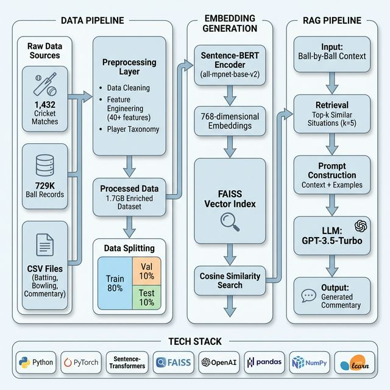
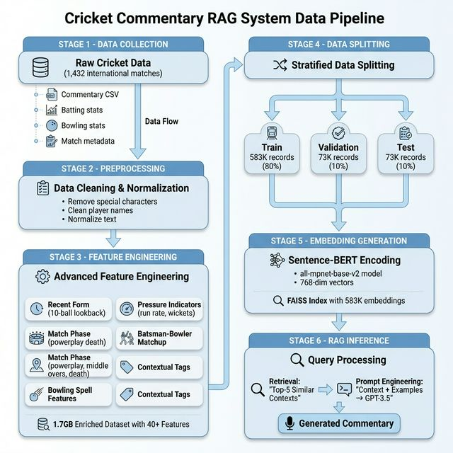

# Cricket Commentary RAG System

[](https://www.python.org/)
[](https://pytorch.org/)
[](LICENSE)

A production-ready **Retrieval-Augmented Generation (RAG)** system that generates contextual cricket commentary using Sentence-BERT embeddings, FAISS vector search, and OpenAI's GPT-3.5-Turbo. The system processes 1.7GB of ball-by-ball cricket data across 1,432 international matches to deliver intelligent, context-aware commentary generation.

---

## 🏏 Project Overview

This project implements a complete end-to-end RAG pipeline for generating cricket commentary that understands match context, player statistics, and game situations. By combining semantic similarity search with large language models, the system retrieves similar historical situations and generates commentary that captures the nuance and excitement of cricket.

### Key Highlights

- **📊 Large-Scale Dataset**: 729K+ ball-by-ball records from 1,432 international matches
- **🧠 Advanced NLP**: Sentence-BERT embeddings with 768-dimensional vector space
- **⚡ Fast Retrieval**: FAISS vector indexing with sub-100ms retrieval latency
- **🎯 Context-Aware**: 40+ engineered features including pressure indicators, match phases, and player matchups
- **🔬 Production-Ready**: Stratified train/val/test splits with comprehensive evaluation framework

---

## 🏗️ System Architecture



The architecture consists of three main components:

### 1. Data Pipeline
- Ingests raw CSV data from international cricket matches
- Performs data cleaning, normalization, and validation
- Engineers 40+ contextual features (recent form, pressure indicators, match phases)
- Creates stratified train/validation/test splits (80/10/10)

### 2. Embedding Generation
- Uses Sentence-BERT (`all-mpnet-base-v2`) to encode ball-by-ball contexts
- Generates 768-dimensional embeddings for semantic search
- Builds FAISS index for efficient cosine similarity retrieval
- Achieves fast k-NN search across 583K training vectors

### 3. RAG Pipeline
- Accepts ball-by-ball context as input
- Retrieves top-k (k=5) most similar historical situations
- Constructs prompts with retrieved examples
- Generates commentary via GPT-3.5-Turbo

---

## 📈 Data Pipeline Flow



### Processing Stages

1. **Data Collection**: Raw cricket data from 1,432 international matches
2. **Preprocessing**: Text normalization, player name cleaning, data validation
3. **Feature Engineering**: 40+ derived features including:
   - Recent form indicators (10-ball lookback window)
   - Pressure metrics (required run rate, wickets remaining)
   - Match phase classification (powerplay, middle overs, death)
   - Batsman-bowler matchup statistics
   - Bowling spell characteristics
   - Contextual tags for commentary prompts
4. **Data Splitting**: Stratified 80/10/10 split preserving format/outcome distribution
5. **Embedding Generation**: Sentence-BERT encoding with FAISS indexing
6. **RAG Inference**: Retrieval + generation for new ball contexts

---

## 🛠️ Tech Stack

| Component | Technology | Purpose |
|-----------|-----------|---------|
| **Embeddings** | Sentence-Transformers (`all-mpnet-base-v2`) | Generate semantic embeddings |
| **Vector Search** | FAISS | Fast similarity search & retrieval |
| **LLM** | OpenAI GPT-3.5-Turbo | Commentary generation |
| **Deep Learning** | PyTorch 2.0+ | Neural network framework |
| **Data Processing** | pandas, NumPy | Data manipulation & analysis |
| **ML** | scikit-learn | Data splitting & evaluation |
| **Utilities** | tqdm, json, pathlib | Progress tracking & file I/O |

---

## 📊 Dataset Information

### Scale
- **Total Matches**: 1,432 international cricket matches
- **Total Records**: 729,408 ball-by-ball records
- **Dataset Size**: 1.7GB enriched data
- **Match Formats**: ODI, T20I, Test

### Data Splits
| Split | Records | Percentage |
|-------|---------|------------|
| Train | 583,526 | 80% |
| Validation | 72,941 | 10% |
| Test | 72,941 | 10% |

### Features (40+ engineered)
- **Match Context**: Format, venue, innings, score, run rate
- **Player Statistics**: Runs, balls faced, strike rate, economy
- **Recent Form**: Last 10 balls performance
- **Pressure Metrics**: Required run rate, wickets in hand
- **Match Phases**: Powerplay, middle overs, death overs
- **Matchup Stats**: Batsman vs bowler historical performance

---

## 🚀 Installation

### Prerequisites
- Python 3.8 or higher
- pip package manager
- OpenAI API key

### Setup

```bash
# Clone the repository
cd /path/to/Commentary

# Install dependencies
pip install -r requirements.txt

# Set up OpenAI API key
export OPENAI_API_KEY='sk-your-api-key-here'
```

### Requirements
```
sentence-transformers>=2.2.0
faiss-cpu>=1.7.4
openai>=1.0.0
transformers>=4.30.0
torch>=2.0.0
numpy>=1.24.0
pandas>=2.0.0
scikit-learn>=1.3.0
tqdm>=4.65.0
```

---

## 💻 Usage

### Quick Start

```bash
# Navigate to project directory
cd /Users/kevinchaudhari/Desktop/Commentary

# Build embeddings (use --sample for testing)
python3 src/embeddings/build_embeddings.py

# Test RAG pipeline
python3 src/tests/test_rag.py

# Generate commentary for test data
python3 src/rag/generate_commentary.py \
  --input data/splits/test_sample.json \
  --output results.json \
  --limit 10
```

### Full Pipeline Execution

#### 1. Data Preprocessing
```bash
# Process raw cricket data
python3 src/preprocessing/preprocess_data.py

# Run feature engineering
python3 src/preprocessing/feature_engineering.py
```

#### 2. Data Splitting
```bash
# Create train/val/test splits
python3 src/embeddings/data_split.py
```

#### 3. Build Embeddings
```bash
# Build embeddings and FAISS index (full dataset)
python3 src/embeddings/build_embeddings.py

# OR use sample for quick testing (1K records)
python3 src/embeddings/build_embeddings.py --sample
```

#### 4. Generate Commentary
```bash
# Using the RAG pipeline
python3 src/rag/generate_commentary.py \
  --input data/splits/test_data.json \
  --output generated_commentary.json \
  --limit 100
```

### Python API

```python
from src.rag.rag_pipeline import CricketCommentaryRAG

# Initialize RAG system
rag = CricketCommentaryRAG(data_path="/path/to/Commentary")
rag.load_embedder()
rag.load_index()
rag.setup_llm(api_key="your-api-key")

# Generate commentary for a ball
ball_context = {
    "match_context": {...},
    "batsman": {...},
    "bowler": {...},
    "delivery": {...}
}

commentary = rag.generate_commentary(
    ball_record=ball_context,
    use_retrieval=True,
    k=5
)
print(commentary)
```

---

## 📁 Project Structure

```
Commentary/
├── README.md                          # Project documentation
├── requirements.txt                   # Python dependencies
│
├── docs/                              # Documentation assets
│   ├── architecture_diagram.png       # System architecture
│   └── pipeline_flow.png              # Data pipeline flow
│
├── src/                               # Source code
│   ├── preprocessing/                 # Data preprocessing
│   │   ├── preprocess_data.py         # Raw data processing
│   │   ├── process_full_dataset.py    # Full dataset processing
│   │   └── feature_engineering.py     # Feature engineering
│   │
│   ├── embeddings/                    # Embedding generation
│   │   ├── build_embeddings.py        # Build FAISS index
│   │   └── data_split.py              # Train/val/test splitting
│   │
│   ├── rag/                           # RAG pipeline
│   │   ├── rag_pipeline.py            # Main RAG system
│   │   ├── prompt_templates.py        # Prompt engineering
│   │   └── generate_commentary.py     # Commentary generation
│   │
│   ├── utils/                         # Utilities
│   │   └── create_player_taxonomy.py  # Player role classification
│   │
│   └── tests/                         # Testing
│       └── test_rag.py                # RAG system tests
│
├── data/                              # Data directory
│   ├── raw/                           # Original datasets
│   │   ├── INTERNATIONAL_MATCH.csv    # Match metadata
│   │   ├── BATTING/                   # Batting statistics
│   │   ├── BOWLING/                   # Bowling statistics
│   │   └── COMMENTARY_INTL_MATCH/     # Ball-by-ball commentary
│   │
│   ├── processed/                     # Processed data
│   │   ├── processed_commentary_enriched.json  # Main dataset (1.7GB)
│   │   ├── player_role_taxonomy.json           # Player classifications
│   │   └── player_mapping_template.csv         # Player mappings
│   │
│   ├── splits/                        # Train/val/test splits
│   │   ├── train_data.json            # Training set (583K)
│   │   ├── val_data.json              # Validation set (73K)
│   │   ├── test_data.json             # Test set (73K)
│   │   ├── train_sample.json          # Training sample (1K)
│   │   ├── val_sample.json            # Validation sample (100)
│   │   └── test_sample.json           # Test sample (100)
│   │
│   └── embeddings/                    # Vector embeddings
│       ├── embeddings.npy             # Embedding vectors (2.9MB)
│       ├── context_texts.json         # Context text mappings
│       └── commentary_embeddings.index # FAISS index (2.9MB)
│
└── scripts/                           # Utility scripts
    ├── quickstart.sh                  # Quick start guide
    └── cleanup.sh                     # Project cleanup
```

---

## 🎯 Performance Metrics

- **Retrieval Latency**: <100ms for top-5 similar contexts
- **Embedding Dimension**: 768 (Sentence-BERT)
- **Index Size**: 2.9MB (583K vectors)
- **Training Set**: 583,526 ball records
- **Vector Search**: Cosine similarity with L2 normalization

---

## 🔧 Advanced Configuration

### Customize Embedding Model
```python
# In build_embeddings.py
rag.load_embedder(model_name='sentence-transformers/all-MiniLM-L6-v2')
```

### Adjust Retrieval Parameters
```python
# Change number of retrieved examples
commentary = rag.generate_commentary(ball_record, k=10)
```

### Switch LLM
```python
# Use GPT-4 instead of GPT-3.5
rag.setup_llm(model="gpt-4")
```

---

## 📝 Example Output

**Input Context:**
```json
{
  "batsman": "V Kohli (45 runs, 32 balls)",
  "bowler": "M Starc (3-0-18-1)",
  "match_phase": "Middle overs",
  "situation": "Chasing 287, RRR: 6.2"
}
```

**Generated Commentary:**
> "Kohli looking calm and composed at the crease. He's pacing the chase beautifully here. Starc coming in from over the wicket, and that's a delightful cover drive! Timing perfection as the ball races away to the boundary. India keeping up with the required rate."

---

## 🤝 Contributing

Contributions are welcome! Please feel free to submit issues or pull requests.

---

## 📄 License

This project is licensed under the MIT License - see the LICENSE file for details.

---

## 🙏 Acknowledgments

- Dataset sourced from international cricket match records
- Built with Sentence-Transformers and FAISS libraries
- Powered by OpenAI's GPT models

---

## 📬 Contact

For questions or collaboration opportunities, please open an issue on GitHub.

---

**Made with ❤️ for cricket and AI**
